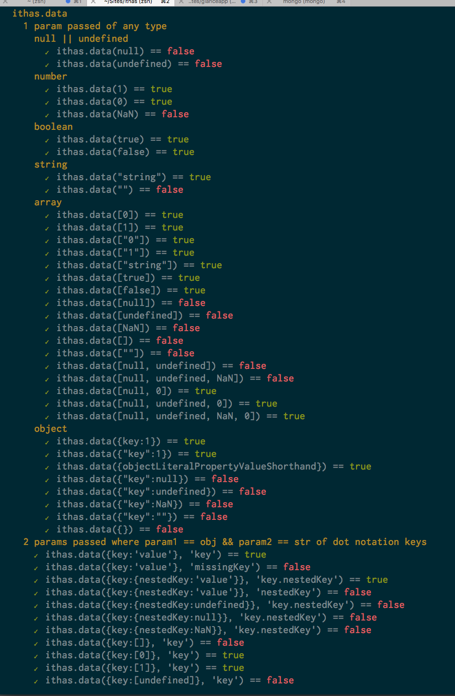

# TL;DR 

# Where lodash is a huge box of bad-ass tools with great docs, ithas is a sharpened, surgical, sugary steel blade... only with terrible docs, endless 's' words , and way big fonts. But... like any powerful [harlequin](http://www.ehow.com/info_12332443_harlequin-ice-cream.html) ninja, ithas, comes to you in a 3-pack of delciousnes magicalness:


## ithas.data 

**format**: `ithas.data(anyDataType, path)`

**returns:** `boolean`

tests ALL data types and as many keys deep as you wish (if checking object) to see if there is any data anywhere, in any of it. undefined, null, NaN, "", [], [""], {}, {key:null}, etc, etc, ad naeseum all return false. Good luck doing that on lodash lol. 49 cases covered by tests and more all the time. Fire and forget! Has a deep setting coming soon that is currently disabled for performance reasons.

```
ithas.data(0) == true
ithas.data("") == false
ithas.data([]) == false
ithas.data({} == false
ithas.data({key:null}) == false
ithas.data({key:0}) == true
ithas.data({key:null}, 'key') == false
ithas.data({key:undefined}, 'key') == false
ithas.data({key:NaN}, 'key') == false
... 49 tested cases and counting...
```

----------------------------------------------------------
## ithas.key

**format**: `ithas.key(obj, path)`

**returns:** `boolean`

WTF brah? Have you ever heard of lodash _.has? Yep. And it's mainly reliable. But, it evaluates false in scary places where things are wrapped that you don't know about (because they may call a toObject prototype behind the scenes to make it look and smell like an object, or JSON, but it's not!) Here's an example: if you try _.has against a mongoose document you just fetched, you will be suprised to see _.has declares that you have no keys! Boom! You just got lodashed in your balls!

Wait, wait, what about using _.get to check for undefined keys or values? Sure that works. What if the value is null? Nan? empty string? Empty array? Another nested key of emptiness? Sorry. 

----------------------------------------------------------
## ithas.value
**format**: `ithas.key(obj, path, value)`
## ithas.value(obj, path, value)
Pretty basic but pretty magic. Just pass it an object, a path as deep as you want in string format, and then value you want to evaluate for. Handle's all the weird cases of null, undefined, keys not there, wrapped crap, etc.  

UPDATE: this is now just a sugary wrapper for lodash _.get(obj, path, val)

# ps I apologize for my shitty code. I am currently busy levelling up.
